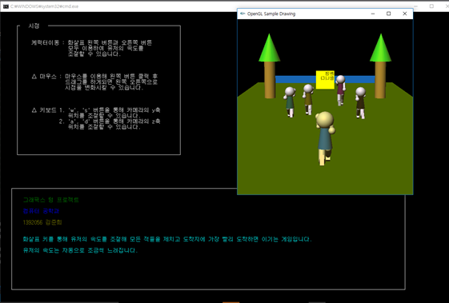

# OpenGL-Running-Game

## 환경 설정

1. UnZip glut-3.7.6-bin 

2. 파일 해당 경로에 옮기기

__glut32.lib__ 
C:\Program Files (x86)\Microsoft SDKs\Windows\v7.1A\Lib 
C:\Program Files (x86)\Windows Kits\8.1\Lib\winv6.3\um\x86 
총 2개 복사 

__glut.h__ 
C:\Program Files (x86)\Microsoft SDKs\Windows\v7.1A\Include\gl 
C:\Program Files (x86)\Windows Kits\8.1\Include\um\gl 
총 2개 복사 

__glut32.dll__ 
C:\Windows\SysWOW64 
총 1개 복사 

3. 프로젝트 설정

구성 속성 – 링커 – 입력 –  추가 종속성 - ▼버튼 – 편집 
__opengl32.lib__ 
__glu32.lib__ 
__glut32.lib__ 
입력 후 확인 

## 작품 설명

- 프로그램 조작, 사용법을 cmd 창을 이용해 보여주도록 하였고 opengl 창을 오른쪽에 보여    주어 게임을 하면서 설명을 볼 수 있도록 만들었습니다.
- 화살표 왼쪽과 오른쪽 키를 번갈아 가며 누르며 게임을 하도록 만들었고 누르고 있을시 에    는 유저의 속도가 빨라지지 않도록 만들었습니다.
- 조명은 빨간색과 노란색의 중간 색깔로 태양빛을 생각하며 만들었습니다.
- 텍스쳐를 사용해 글씨를 넣어 골인지점에 부착해 끝이 골인지점인 것을 더욱 명확하게 만들    었습니다.
- 적들의 속도는 게임 실행시마다 랜덤하게 구현했습니다
- 나중에 프로그램을 수정하기 쉽게 최대한 함수를 많이 만들어 코드를 깔끔하게 정리하여 만    들었습니다.
- 그래픽스 수업 때 배운 것을 최대한 활용하기 위해 시점을 다양하게 볼 수 있도록 노력했    고 바닥을 제외한 나머지 색깔은 조명을 이용해 색을 입혔습니다.

* intro.h : 게임설명을 위해 구현한 헤더파일입니다.
* main.cpp : 메인 소스입니다.
* camera.h, camera.cpp : 카메라 사용을 위한 소스입니다.
* dib.h. dib.cpp : 텍스쳐 사용을 위한 소스입니다.

## 캡쳐 사진

